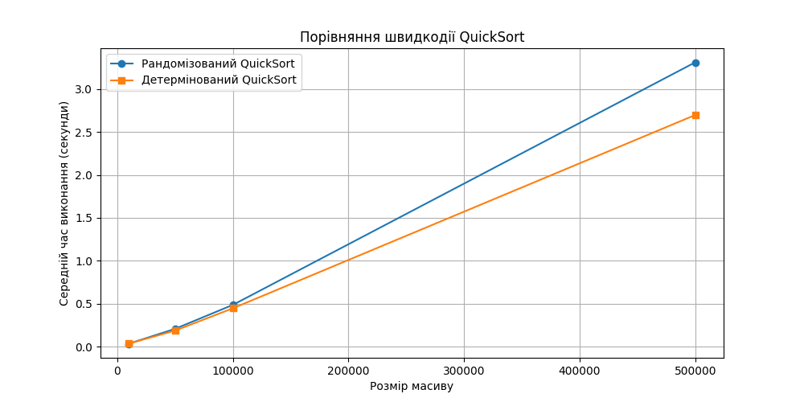

# goit-algo2-hw-10

## Завдання 1

--------------------------------------------------------------------------------

Результати за вказаними в ТЗ розмірами масивів:

```log
Розмір масиву: 10000
Рандомізований QuickSort: 0.0362 секунд
Детермінований QuickSort: 0.0376 секунд
--------------------------------------------------------------------------------
Розмір масиву: 50000
Рандомізований QuickSort: 0.2092 секунд
Детермінований QuickSort: 0.1885 секунд
--------------------------------------------------------------------------------
Розмір масиву: 100000
Рандомізований QuickSort: 0.4879 секунд
Детермінований QuickSort: 0.4482 секунд
--------------------------------------------------------------------------------
Розмір масиву: 500000
Рандомізований QuickSort: 3.3095 секунд
Детермінований QuickSort: 2.6968 секунд
--------------------------------------------------------------------------------
```




На малих обсягах даних обидва алгоритми працюють приблизно однаково.
На більших наборах детермінований QuickSort працював трохи швидше в даному експерименті, хоча це може змінюватися залежно від структури вхідних даних.
Рандомізований QuickSort залишається кращим вибором у загальному випадку, оскільки унеможливлює найгірший сценарій. 


--------------------------------------------------------------------------------
## Завдання 2

--------------------------------------------------------------------------------

Отримали розклад:

```log

✅ Розклад занять:
Наталія Шевченко, 29 років, email: n.shevchenko@example.com 
   Викладає предмети: Біологія, Хімія

Дмитро Бондаренко, 35 років, email: d.bondarenko@example.com
   Викладає предмети: Інформатика, Фізика

Олександр Іваненко, 45 років, email: o.ivanenko@example.com 
   Викладає предмети: Математика
   ```